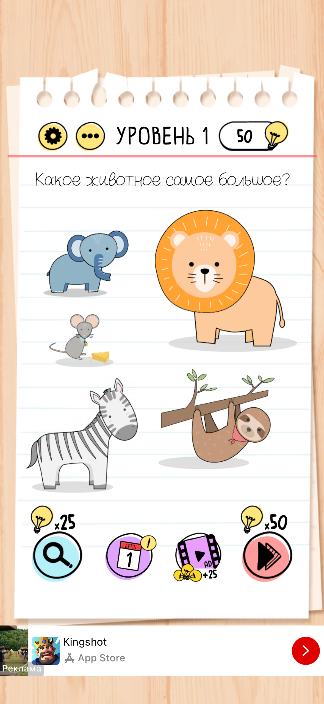
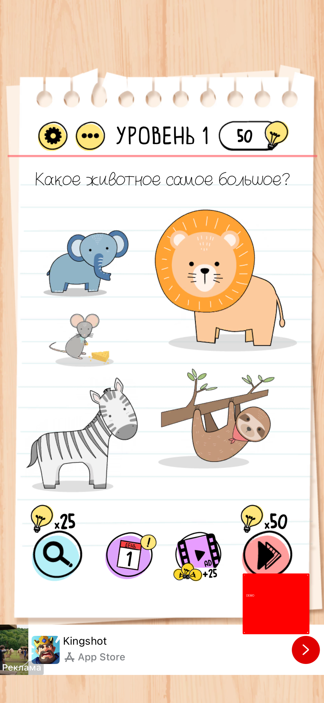

# BUG-SCREEN_2

## Summary

UI of **screen_2** does not match the Figma reference design.

## Status

**FAIL**

## Severity

**Major**

## Environment

- Execution mode: Demo
- Framework: Python / Pytest
- Reference source: Figma
- Actual source: simulated runtime screenshot

## Steps to Reproduce

1. Run:

   `pytest -m visual -v`

2. Execute the visual comparison for `screen_2`.

3. Compare the runtime screenshot with the Figma reference.

## Expected Result

The application screen should visually correspond to the Figma design.

No additional UI element should be present.

## Actual Result

The actual screen differs from the Figma reference.

An unexpected UI element was detected.

## Visual Metrics

| Metric | Value |
|---|---:|
| SSIM | 0.98967 |
| Different pixels | 1.700% |
| Expected size | 1179 × 2556 |
| Actual size | 1179 × 2556 |

## Detected Defect Regions

- x=885, y=2087, width=238, height=216

## Evidence

### Expected — Figma

### Actual — Runtime

### Difference

### Detected Region

## Result

The visual regression test detected that:

`expected != actual`

The detected difference was localized to the reported bounding box(es).
